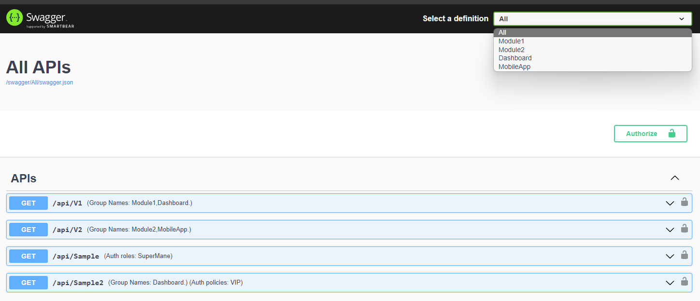

# Neptunee.Swagger


[](https://www.nuget.org/packages/Neptunee.Swagger)

### Generate Swagger with additional useful info



## Get Starting

- Install the NuGet package:

```
dotnet add package Neptunee.Swagger
```

- ApiGroup Enum

```csharp
public enum SampleApiGruop
{
    [NeptuneeDocInfoGenerator(title: "All APIs")]
    All,

    [NeptuneeDocInfoGenerator(title: "Module1 APIs", version: "v1")]
    Module1,

    [NeptuneeDocInfoGenerator(version: "Module2 APIs")]
    Module2,

    [NeptuneeDocInfoGenerator(title: "Dashboard APIs")]
    Dashboard,

    [NeptuneeDocInfoGenerator(title: "MobileApp APIs")]
    MobileApp,
}
```

- DI registration:

```csharp
builder.Services.AddNeptuneeSwagger(o =>
    o.SwaggerDocs<SampleApiGruop>()
        .GroupNamesDocInclusion(escapeDocs: SampleApiGruop.All.ToString())
        .AddJwtBearerSecurityScheme());
```

- Use Middleware:

```csharp
app.UseNeptuneeSwagger(o => o.AddEndpoints<SampleApiGruop>());
```

## Using

- How do Group APIs ?

```csharp
    [NeptuneeApiGroup<ApiGroupNames>(ApiGroupNames.Dashboard)]
    public IActionResult Api() => Ok();
```

<div style="display: flex;justify-content: center;"> 

[NuGet](https://www.nuget.org/packages/Neptunee.Swagger/) | [Sample](https://github.com/HusseinnHM/Neptunee.Swagger/blob/master/Sample.API)

</div>